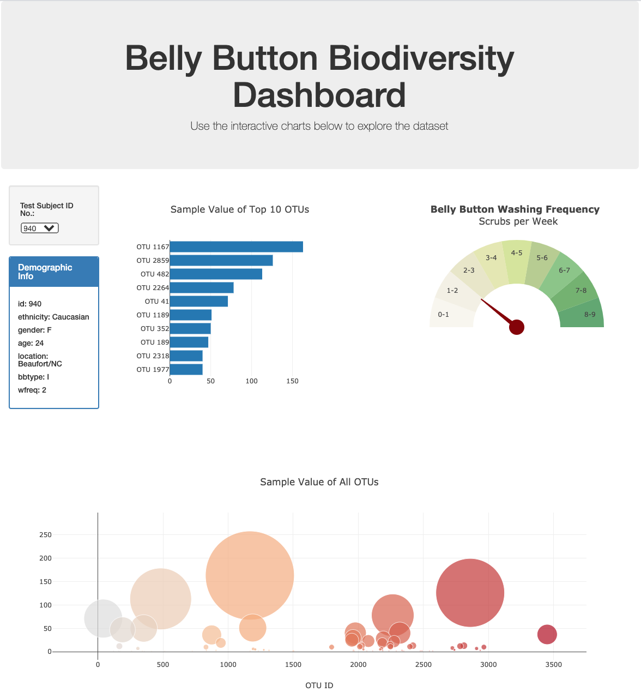

# Plot.ly Biodiversity Project

## Task

To build an interactive dashboard that explores the [Belly Button Biodiversity dataset](http://robdunnlab.com/projects/belly-button-biodiversity/), which catalogs the microbes that colonise human navels.

The dataset reveals that a small handful of microbial species (also called operational taxonomic units, or OTUs, in the study) were present in more than 70% of people, while the rest were relatively rare.

## Tools and Technologies

- Javascript
- HTML
- Plotly
- D3

## Dashboard

The dashboard contains three charts and a panel of sample metadata, i.e., an individual's demographic information. 

These update every time a new sample number is selected from a dropdown menu. Each sample number is the ID of a test subject.

### 1: Horizontal Bar Chart

A horizontal bar chart displays the top 10 OTUs found in the selected test subject and their frequency.

* `sample_values` is used as the values for the bar chart.

*  `otu_ids` is used as the labels for the bar chart.

*  `otu_labels` is used as the hovertext for the chart.

### 2: Bubble Chart

A bubble chart displays every sample for the selected test subject.

*  `otu_ids` is used for the x values.

*  `sample_values` is used for the y values.

*  `sample_values` is used for the marker size.

*  `otu_ids` is used for the marker colors.

*  `otu_labels` is used for the text values.

### 3: Gauge Chart

The gauge chart plots the weekly washing frequency of the selected test subject.

### 4: Metadata Panel

The metadata panel displays the sample metadata, i.e., an individual's demographic information.
It is presents each key-value pair from the metadata JSON object.

## Deployment

The project is deployed at https://dan1ellec.github.io/biodiversity_dashboard/

## Preview

- - -

### About the Data

Hulcr, J. et al.(2012) _A Jungle in There: Bacteria in Belly Buttons are Highly Diverse, but Predictable_. Retrieved from: [http://robdunnlab.com/projects/belly-button-biodiversity/results-and-data/](http://robdunnlab.com/projects/belly-button-biodiversity/results-and-data/)
